# Arquitectura Big Data para dispositivos IoT

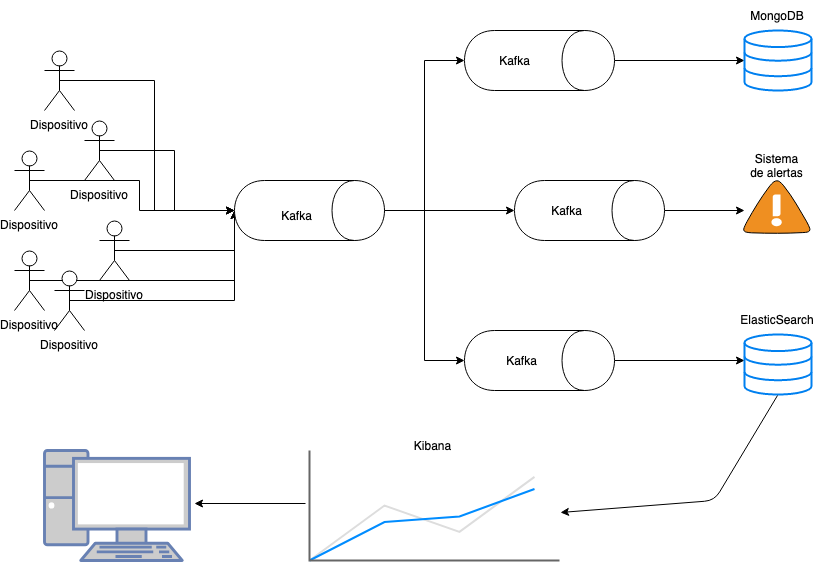

## REQUISITOS PREVIOS

- Mínimo 16gb de memoria RAM
- Tener instalado docker y docker-compose
- Subir la RAM mínima destinada a docker a 12gb en el menú de docker `/preferences/advanced`
- Tener instalado NodeJS

## Puesta en marcha de Kafka, ElasticSearch & MongoDB

### Kafka

Para comenzar levantaremos los servicios de Kafka. Para ello, usaremos un docker-compose extraido de la página web de Confluent, con una serie de servicios, entre ellos Kafka y el Centro de Control de Confluent.
El Centro de Control Confluent es una herramienta que proporciona una serie de facilidades para configurar Kafka y los datos que fluyen a través de él. El Centro de Control nos brinda al administrador capacidades de monitoreo y administración a través de paneles de control.

Para poner en marcha todo esto, ejecutaremos el script:

```
npm run start-kafka 
```

Esto pondrá en marcha los siguientes servicios:
- ZooKeeper
- Broker de Kafka
- Conector de Kafka para DataGen
- Confluent Control Center
- KSQL Server
- KSQL CLI
- KSQL DataGen
- Un proxy REST
- Schema Registry

### ElasticSearch y MongoDB

A continuación, arrancaremos los servicios de ElasticSearch, Kibana, Cerebro y MongoDB.

Kibana lo utilizaremos para observar métricas y analizar los datos existentes en ElasticSearch.

Cerebro es una herramienta a través de la cual podremos visualizar y modificar todos los aspectos de configuración del cluster de ElasticSearch, como sus mappings, estado de los nodos, ejecutar consultas, eliminar índices, etc..

Para arrancar todo, ejecutaremos el siguiente script:
```
npm run start-elastic-mongo
```

### Utilidades

Para ver el estado de nuestros contenedores docker, bastará con ejecutar el siguiente comando:
```
npm run docker-ps
```

Para pararr todos nuestros contenedores docker, ejecutaremos la siguiente instrucción:
```
npm run docker-stop
```

### Creación de los topics

Para poner en funcionamiento el proyecto necesitaremos crear topics. Si usamos los nombres por defecto para los topics, estos deberían ser:

- `to-multiplexer`: es el topic que recibe los mensajes de los dispositivos IoT y multiplexa los mensajes a otros topics.
- `to-mongo`: es el topic que se encargará de recibir los mensajes que se insertarán a MongoDB.
- `to-elastic`: es el topic que se encargará de recibir los mensajes que se insertarán a ElasticSearch.
- `to-alerts`: es el topic que se encargará de recibir los mensajes para generar las alertas.

## Productor

Es el encargado de generar los mensajes emulando los dispositivos IoT.
Tiene las siguientes variables de entorno:

- `TEST`: el nombre del tets que vamos a efectuar desde los dispositivos IoT.
- `TIMEOUT`: es el tiempo de espera en milisegundos entre el envío de mensaje y mensaje. Por defecto 1000.
- `VALUE_MAX`: valor máximo que se podrá generar. Por defecto 150.
- `VALUE_MIN`valor mínimo que se podrá generar. Por defecto 0.
- `MULTIPLEXER_TOPIC`: por defecto `to-multiplexer`
- `KAFKA_BROKER`: por defecto `localhost:9092`

Para iniciar el productor, tendremos que ejecutar la instrucción:
```
npm run productor
```

## Consumidores

### Multiplexador
El multiplexador multiplexa los mensajes emitidos por el productor y los envía a los topics `to-elastic`, `to-mongo` y `to-alerts`.
Tiene las siguientes variables de entorno:
- `KAFKA_BROKER`: por defecto `localhost:9092`
- `MULTIPLEXER_TOPIC`: por defecto `to-multiplexer`

Para iniciar el multiplexador, ejecutaremos la instrucción:
```
npm run multiplexer
```

### MongoDB
El consumidor de mongo introducirá en MongoDB todos los mensajes que reciba del multiplexador. Los documentos introducidos tendrán tres campos: `test`, `timestamp`y `value`.
- `KAFKA_BROKER`: por defecto `localhost:9092`
- `MONGO_URL`: por defecto `mongodb://localhost:27017/`
- `MONGO_TOPIC`: por defecto `to-mongo`

Para iniciar el consumidor de mongo, ejecutaremos la instrucción:
```
npm run mongo
```

### ElasticSearch
El consumidor de elastic introducirá en ElasticSearch todos los mensajes que reciba del multiplexador. Los documentos introducidos tendrán tres campos: `test`, `date`y `value`.
- `KAFKA_BROKER`: por defecto `localhost:9092`
- `ELASTIC_URL`: por defecto `elastic:changeme@localhost:9200`
- `ELASTIC_TOPIC`: por defecto `to-elastic`

Para iniciar el consumidor de elastic, ejecutaremos la instrucción:
```
npm run elastic
```

### Alertas
Las alertas tienen dos funcionalidades.

Por un lado, nos avisarán cuando el valor medio llegue a un umbral determinado en un periodo mínimo de tiempo.

Por otro lado, cada cierto número de mensajes, nos comunicará el valor medio de los documentos hasta ese instante.

Existen las siguientes variables de entorno:
- `TTL`: Es el tiempo mínimo que vamos a dejar de margen para que se genere una media fiable con las muestras suficientes para poder tener en cuenta su valor medio para generar una alerta. Su valor es en milisegundos. Por defecto es 10 segundos.
- `COUNT`: número de documentos necesarios para notificar una alerta y comprobar el estado de la media de los valores. Por defecto es 10.
- `THRESHOLD`: valor con el que valor a comparar la media para decidir si se genera una alerta o no. Por defecto es 100
- `COMPARATOR`: operador de comparación para operar sobre el valor. Sus valores posibles son `GT`, `GTE`, `LT` y `LTE`. Por defecto es `GT`.

Un ejemplo de configuración sería:
```
TTL = 10 * 1000;
COUNT = 20;
THRESHOLD = 100;
OPERATOR = 'GT';
```
En este caso, se dejaría un tiempo de margen de 10 segundos para que se empiecen a examinar los documentos para generar alertas, y en caso de que la media sea mayor de 100, se generá una alerta y todos los valores se pondrán a 0.

Por otro lado, cada 20 documentos nos informará de la media actual.

## Visualización

Para la visualización usaremos Kibana. Para ello, nos dirigiremos a [http://localhost:5601](localhost:5601).
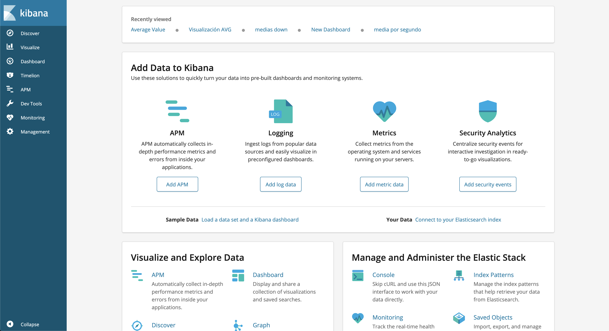

### Configuración del patrón

Primero, configuraremos nuestro patrón de índice. Este patrón será el nombre del test elegido en el productor. Para ello, nos dirigiremos a Management, y en la sección de Kibana clicaremos sobre `Index Patterns`.

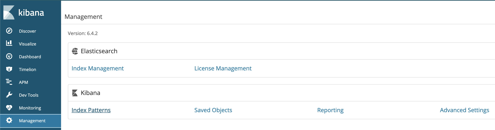

A continuación, si nuestro test se llama `speed-up`, por ejemplo, definiremos nuestro patrón como `speed-up`y clicaremos sobre `Next Step`

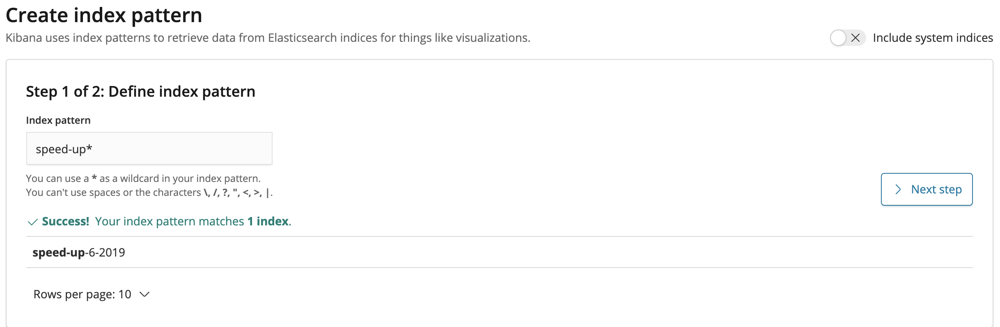
A continuación seleccionaremos `date`como `Time Filter field name`.

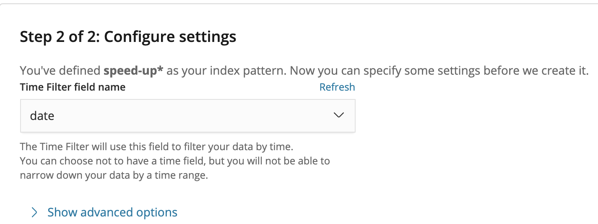

### Configuración de la visualización
Para generar nuevas visualizaciones, clicaremos sobre `Visualize` en el menú lateral de la izquierda y clicaremos sobre el boton `+`

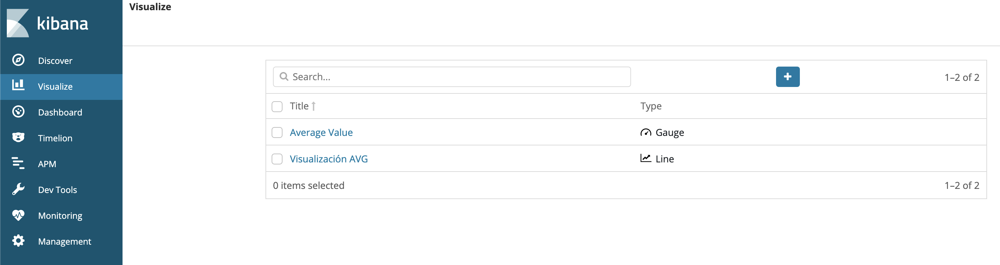

En la siguiente pantalla selecionaremos, por ejemplo, la visualización topo `Line`.

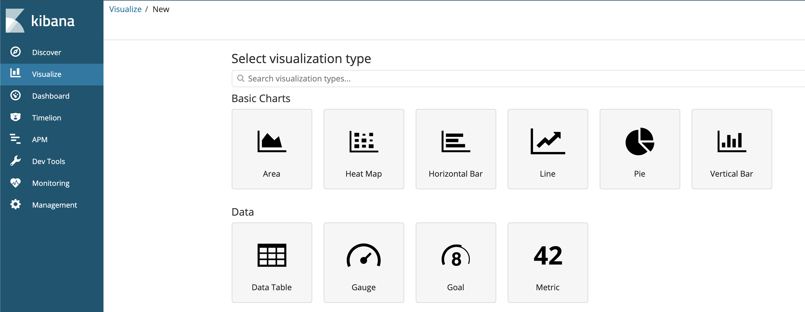

Configuraremos la visualización con los siguientes parámetros, para tener en el eje Y la media del valor de nuestros documentos y en el eje X el tiempo.

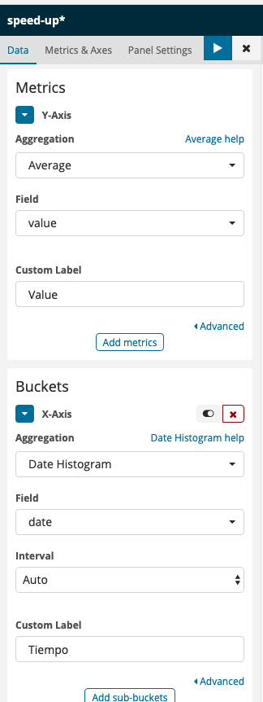

Le daremos al botón de reproducir y podemos observar los resultados:

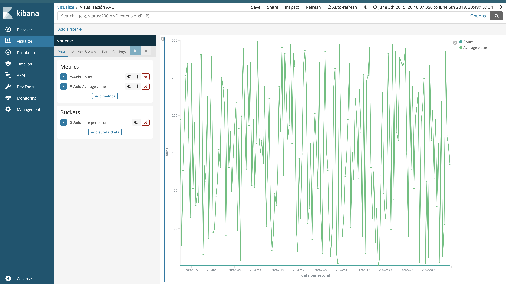
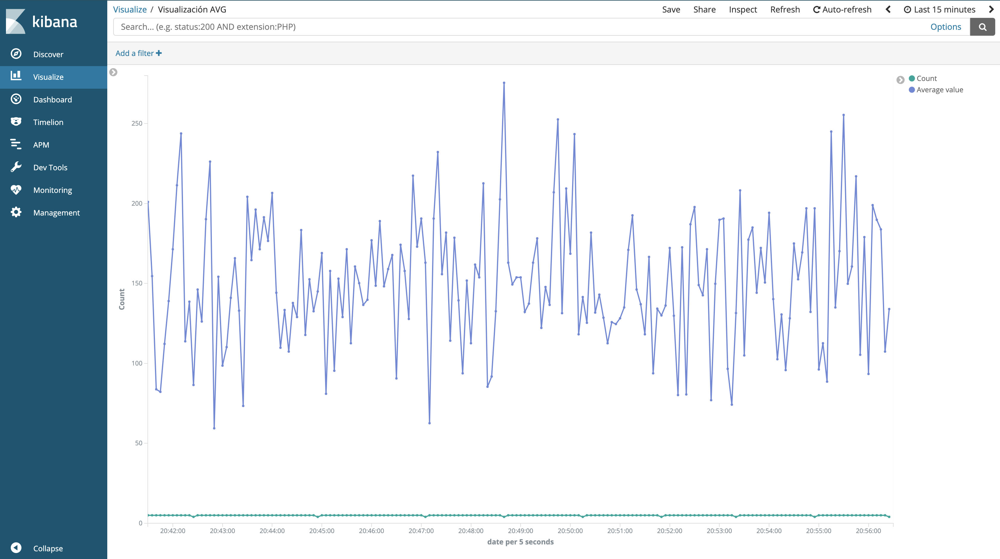

Podemos hacer mas tipos de gráficos y visualizaciones. Como los que se observan en el siguiente Dashboard generado:

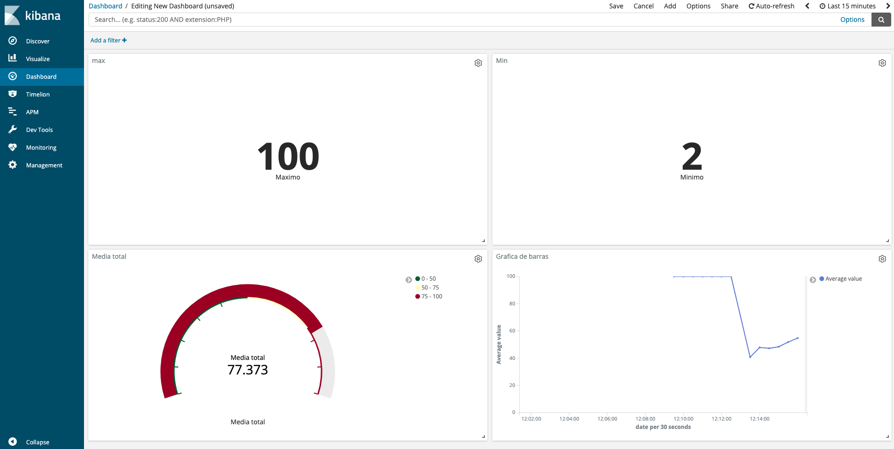
